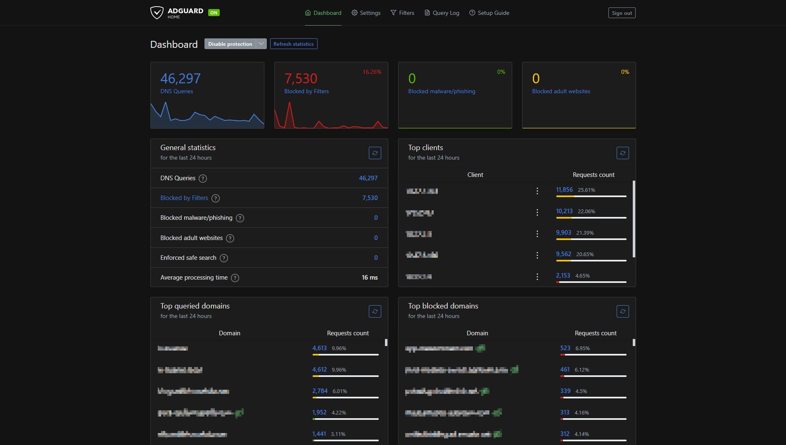

# AdGuard ([Website]{:target="_blank"})

[Website]: https://adguard.com/en/welcome.html


## About AdGuard

AdGuard Home is a network-wide software that blocks advertisements and trackers. It operates as a DNS server, designed to intercept DNS queries and filter out unwanted content, thus enhancing privacy and security for all devices on a home network. This self-hosted solution provides users with control over their browsing experience by blocking intrusive ads, phishing, and malware sites. AdGuard Home is customizable, with an intuitive web interface that allows users to manage settings, view analytics, and configure filtering rules. It is compatible with various operating systems and can be installed on devices like Raspberry Pi, ensuring flexibility and ease of deployment.

## Screenshots



## Docker Compose (`docker-compose.yaml`)
``` yaml
services:
  adguard:
    image: adguard/adguardhome
    container_name: adguard-home
    restart: unless-stopped
    ports:
      - 53:53/tcp
      - 53:53/udp
      - ${ADMIN_PORT}:80 # Admin Panel
      - ${SETUP_PORT}:3000 # Setup Port
    volumes:
      - /etc/timezone:/etc/timezone
      - ${WORK_DIR}:/opt/adguardhome/work
      - ${CONF_DIR}:/opt/adguardhome/conf
```

## Environment File (`.env`)
```
ADMIN_PORT=80
SETUP_PORT=3000
WORK_DIR=path/to/work/dir
CONF_DIR=path/to/conf/dir
```