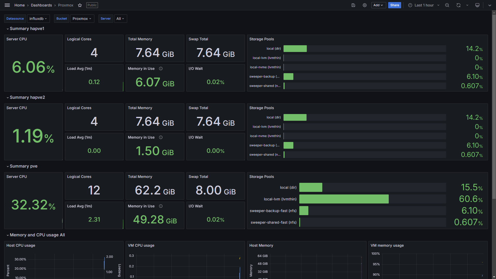

# Grafana ([Website]{:target="_blank"})

[Website]: https://grafana.com/


## About Grafana


Grafana is a self-hosted analytics and monitoring platform that visualizes data from various sources in customizable dashboards. It supports a wide range of data sources like Prometheus, Graphite, and InfluxDB, and allows users to create interactive graphs, charts, and alerts. Grafana is widely used for monitoring and analyzing system performance, application metrics, and business data, offering powerful querying capabilities and flexible alerting to help users stay informed about their systems and data in real time.

## Screenshots



## Docker Compose (`docker-compose.yaml`)
``` yaml
services:
  grafana:
    image: grafana/grafana:latest
    container_name: grafana
    restart: unless-stopped
    ports:
      - ${GRAFANA_PORT}:3000
    volumes:
      - /etc/timezone:/etc/timezone
      - ${GRAFANA_DIR}:/var/lib/grafana
    environment:
      - GF_FEATURE_TOGGLES_ENABLE=publicDashboards
```

## Environment File (`.env`)
```
GRAFANA_PORT=3000
GRAFANA_DIR=path/to/grafana/dir
```