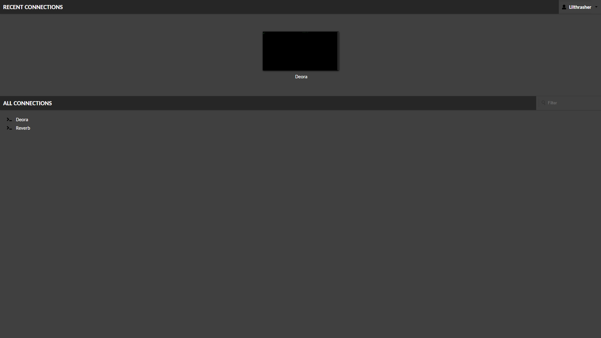

# Guacamole ([Website]{:target="_blank"})

[Website]: https://guacamole.apache.org/


## About Guacamole

Apache Guacamole is a clientless remote desktop gateway that allows users to access their computers and servers via a web browser. It's called "clientless" because it doesn't require any plugins or client software to be installed on the user's device. Instead, it uses HTML5 to provide access to remote machines.

With Guacamole, users can connect to their desktops using protocols such as RDP, VNC, and SSH, providing a versatile solution for remote access. The application is self-hosted, giving users control over their remote access infrastructure. It supports multiple users and connections, and offers features like file transfer, clipboard synchronization, and multi-factor authentication. Guacamole's web-based interface is straightforward and user-friendly, making it easy to manage remote sessions securely and efficiently.

## Screenshots




## Docker Compose (`docker-compose.yaml`)
``` yaml
services:
  guacamole:
    image: guacamole/guacamole
    container_name: guacamole-web
    restart: unless-stopped
    ports:
      - ${GUAC_PORT}:8080
    volumes:
      - ${GUAC_DIR}/extensions/:/etc/guacamole/extensions/
    environment:
      - GUACD_HOSTNAME=guacd
      - POSTGRES_HOSTNAME=postgres
      - POSTGRES_DATABASE=guacamole_db
      - POSTGRES_USER=${DB_USER}
      - POSTGRES_PASSWORD=${DB_PASS}
      - GUACAMOLE_HOME=/etc/guacamole/
    depends_on:
      guacd:
        condition: service_started
      postgres:
        condition: service_started

  guacd:
    image: guacamole/guacd
    container_name: guacamole-daemon
    restart: unless-stopped
    volumes:
      - ${GUAC_DIR}/drive:/drive:rw
      - ${GUAC_DIR}/record:/record:rw

  postgres:
    image: postgres
    container_name: guacamole-postgres
    restart: unless-stopped
    volumes:
    - ${GUAC_DIR}/init/initdb.sql:/docker-entrypoint-initdb.d/initdb.sql
    - ${GUAC_DIR}/db:/var/lib/postgresql/data
    environment:
      - POSTGRES_DB=guacamole_db
      - POSTGRES_USER=${DB_USER}
      - POSTGRES_PASSWORD=${DB_PASS}
```

## Environment File (`.env`)
```
GUAC_PORT=8080
GUAC_DIR=path/to/guac/dir
DB_USER=db_user
DB_PASS=db_pass
```