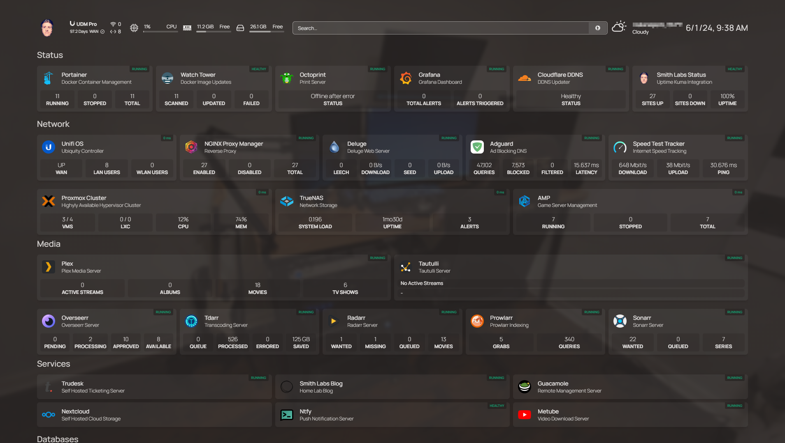

# Homepage ([Website]{:target="_blank"})

[Website]: https://gethomepage.dev/main/


## About Homepage

Homepage is a self-hosted web application that acts as a customizable personal dashboard. It allows users to organize and access frequently used links, widgets, and information from a single, centralized start page. Key features include support for bookmarks, weather updates, system monitoring, and to-do lists. Its easy configuration and responsive design make it adaptable to individual needs, ensuring privacy and control over data since it is self-hosted.

## Screenshots



## Docker Compose (`docker-compose.yaml`)
``` yaml
services:
  homepage:
    image: ghcr.io/gethomepage/homepage:latest
    container_name: homepage
    restart: unless-stopped
    ports:
      - ${PAGE_PORT}:3000
    volumes:
      - /etc/timezone:/etc/timezone
      - ${PAGE_DIR}:/app/config
```

## Environment File (`.env`)
```
PAGE_PORT=3000
PAGE_DIR=path/to/page/dir
```