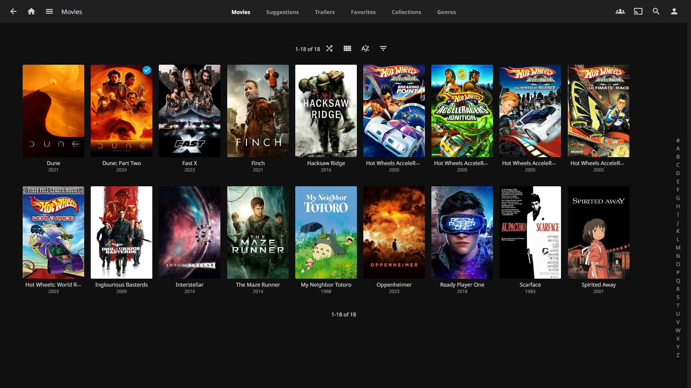

# Jellyfin ([Website]{:target="_blank"})

[Website]: https://jellyfin.org/


## About Jellyfin

Jellyfin is a self-hosted media server application that allows you to manage and stream your personal media collection, such as movies, TV shows, music, and photos, across various devices. It is an open-source alternative to Plex and Emby, providing similar functionalities without any subscription fees or data tracking. Jellyfin supports multiple platforms, offers a web-based interface, and has apps for various devices, ensuring easy access and media playback. It gives users complete control over their media and server, emphasizing privacy and customization.

## Screenshots



## Docker Compose (`docker-compose.yaml`)
``` yaml
services:
  jellyfin:
    image: lscr.io/linuxserver/jellyfin:latest
    container_name: jellyfin
    network_mode: host
    environment:
      - PUID=${PUID}
      - PGID=${PGID}
      - TZ=${TZ}
    volumes:
      - ${CONFIG_DIR}/jellyfin:/config
      - ${MOVIE_DIR}:/data/movies
      - ${TV_DIR}:/data/tvshows
    restart: unless-stopped
```

## Environment File (`.env`)
```
PUID=1000
PGID=1000
TZ=path/to/timezone
CONFIG_DIR=path/to/config/dir
MOVIE_DIR=path/to/movie/dir
TV_DIR=path/to/tv/dir
```