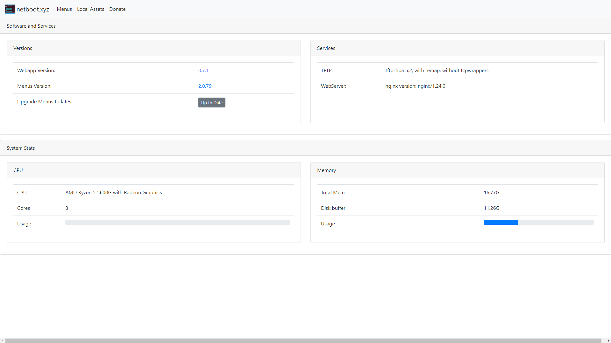

# Netboot XYZ ([Website]{:target="_blank"})

[Website]: https://netboot.xyz/


## About Netboot XYZ

Netboot XYZ is a self-hosted application that facilitates network-based booting of operating systems and utilities. It allows users to boot into a variety of OS installers and live environments over a network using PXE (Preboot Execution Environment) without the need for physical media. Netboot XYZ supports numerous Linux distributions, diagnostic tools, and other utilities, streamlining the deployment and maintenance of systems. It is highly useful for system administrators and IT professionals who need to manage multiple machines efficiently.

## Screenshots




## Docker Compose (`docker-compose.yaml`)
``` yaml
services:
  netbootxyz:
    image: lscr.io/linuxserver/netbootxyz:latest
    container_name: netbootxyz
    restart: unless-stopped
    ports:
      - ${NETBOOT_PORT}:3000
      - 69:69/udp
    volumes:
      - /etc/timezone:/etc/timezone
      - ${NETBOOT_DIR}:/config
    environment:
      - PUID=${PUID}
      - PGID=${PGID}
```

## Environment File (`.env`)
```
PUID=1000
PGID=1000
NETBOOT_PORT=3000
NETBOOT_DIR=path/to/netboot/dir
```