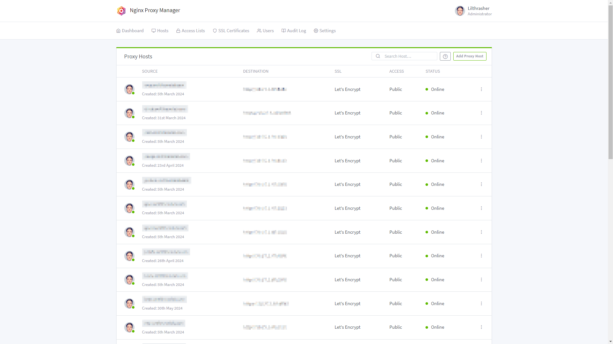

# Nginx Proxy Manager ([Website]{:target="_blank"})

[Website]: https://nginxproxymanager.com/


## About Nginx Proxy Manager

Nginx Proxy Manager is a self-hosted application that provides a user-friendly interface for managing Nginx proxy servers. It simplifies the process of setting up and managing reverse proxies, SSL certificates, and basic web server configurations. The application allows users to route traffic, secure their sites with SSL, and manage multiple proxy hosts easily. It's ideal for those who want to leverage the power of Nginx without dealing with its complex configuration files directly.

## Screenshots



## Docker Compose (`docker-compose.yaml`)
``` yaml
services:
  npm:
    image: jc21/nginx-proxy-manager:latest
    container_name: nginx-proxy-manager
    restart: unless-stopped
    ports:
      - 80:80
      - 443:443
      - ${ADMIN_PORT}:81 # Admin Panel
    volumes:
      - /etc/timezone:/etc/timezone
      - ${DATA_DIR}:/data
      - ${LETSENCRYPT_DIR}:/etc/letsencrypt
```

## Environment File (`.env`)
```
ADMIN_PORT=81
DATA_DIR=path/to/data/dir
LETSENCRYPT_DIR=path/to/letsencrypt/dir
```