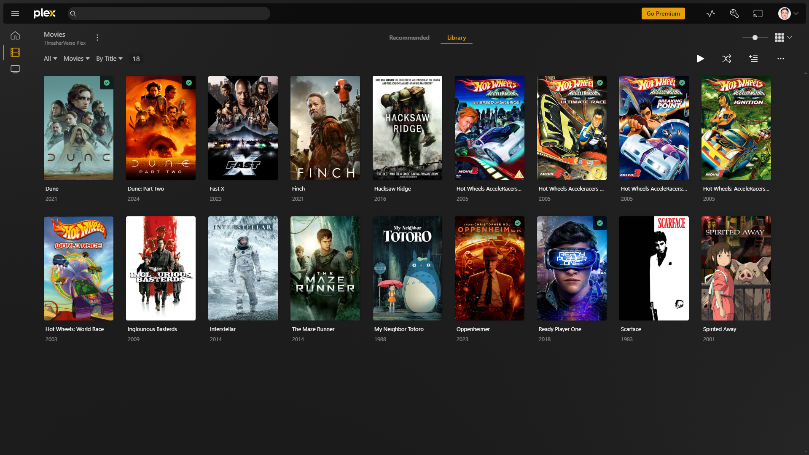

# Plex ([Website]{:target="_blank"})

[Website]: https://www.plex.tv/


## About Plex

Plex is a self-hosted media server application that organizes and streams your personal media collection, including movies, TV shows, music, photos, and home videos, to various devices. It provides a user-friendly interface and supports multiple platforms, allowing you to access your media from anywhere. Plex also offers features like metadata fetching, media playback syncing, and remote access. While it has premium features available through Plex Pass, the core functionality of organizing and streaming media is free.

## Screenshots



## Docker Compose (`docker-compose.yaml`)
``` yaml
services:
  plex: #default port is 32400
    image: lscr.io/linuxserver/plex:latest
    container_name: plex
    network_mode: host
    environment:
      - PUID=${PUID}
      - PGID=${PGID}
      - TZ=${TZ}
      - VERSION=docker
    volumes:
      - ${CONFIG_DIR}/plex:/config
      - ${MEDIA_DIR}:/data/media
    restart: unless-stopped

  tautulli: #default port is 8181
    image: lscr.io/linuxserver/tautulli:latest
    container_name: tautulli
    network_mode: host
    environment:
      - PUID=${PUID}
      - PGID=${PGID}
      - TZ=${TZ}
    volumes:
      - ${CONFIG_DIR}/tautulli:/config
    restart: unless-stopped
```

## Environment File (`.env`)
```
PUID=1000
PGID=1000
TZ=path/to/timezone
CONFIG_DIR=path/to/config/dir
MEDIA_DIR=path/to/media/dir
```