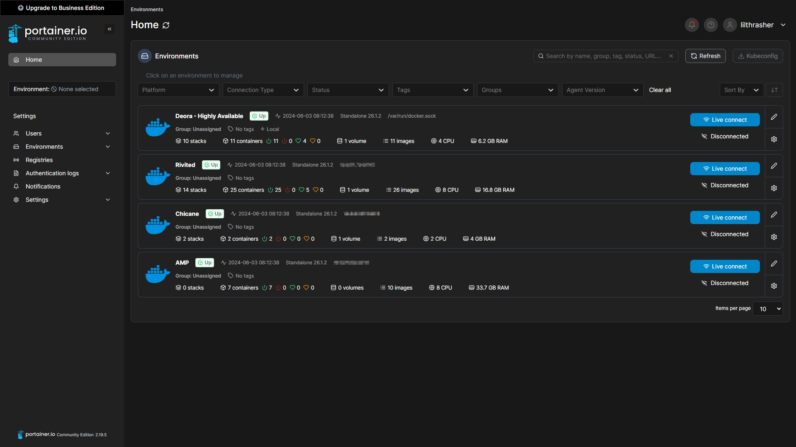

# Portainer ([Website]{:target="_blank"})

[Website]: https://www.portainer.io/


## About Portainer

Portainer is a self-hosted management tool for Docker and Kubernetes that provides a user-friendly web interface to simplify container management. It allows users to deploy, manage, and troubleshoot containerized applications and services easily. With Portainer, users can visualize their container environments, manage stacks, networks, and volumes, and monitor the health of their applications. It supports both individual and clustered environments, making it a powerful tool for both beginners and advanced users in container orchestration.

## Screenshots



## Docker Compose (`docker-compose.yaml`)
``` yaml
services:
  portainer:
    image: portainer/portainer-ce:latest
    container_name: portainer
    restart: unless-stopped
    ports:
      - ${PORT_PORT}:9000
    volumes:
      - /etc/timezone:/etc/timezone
      - ${PORT_DIR}:/data
      - ${DOCKER_VOLUMES}
      - ${DOCKER_SOCK}
```

## Environment File (`.env`)
```
PORT_PORT=9000
PORT_DIR=path/to/port/dir
DOCKER_VOLUMES=/var/lib/docker/volumes:/var/lib/docker/volumes
DOCKER_SOCK=/var/run/docker.sock:/var/run/docker.sock
```