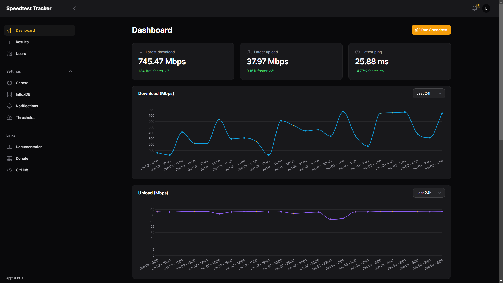

# Speed Test Tracker ([Website]{:target="_blank"})

[Website]: https://docs.speedtest-tracker.dev/


## About Speed Test Tracker

Speed Test Tracker is a self-hosted application designed to monitor and log your internet connection speed over time. It regularly performs speed tests and records the results, providing detailed insights into your upload and download speeds, latency, and overall network performance. The application features a user-friendly dashboard to visualize the data through charts and graphs, helping users track trends and identify issues with their internet service.

## Screenshots



## Docker Compose (`docker-compose.yaml`)
``` yaml
services:
  speedtest-tracker:
    image: lscr.io/linuxserver/speedtest-tracker:latest
    container_name: speedtest-tracker
    restart: unless-stopped
    ports:
      - ${SPEED_PORT}:443
    volumes:
      - /etc/timezone:/etc/timezone
      - ${SPEED_DIR}:/config
    environment:
      - PUID=1000
      - PGID=1000
      - DB_CONNECTION=sqlite
      - APP_KEY=base64:${APP_KEY}
      - DISPLAY_TIMEZONE=${TZ}
      - PRUNE_RESULTS_OLDER_THAN=30
      - SPEEDTEST_SCHEDULE=0 * * * *
```

## Environment File (`.env`)
```
PUID=1000
PGID=1000
SPEED_PORT=443
SPEED_DIR=path/to/speed/dir
APP_KEY=app_key
TZ=ETC/UTC
```