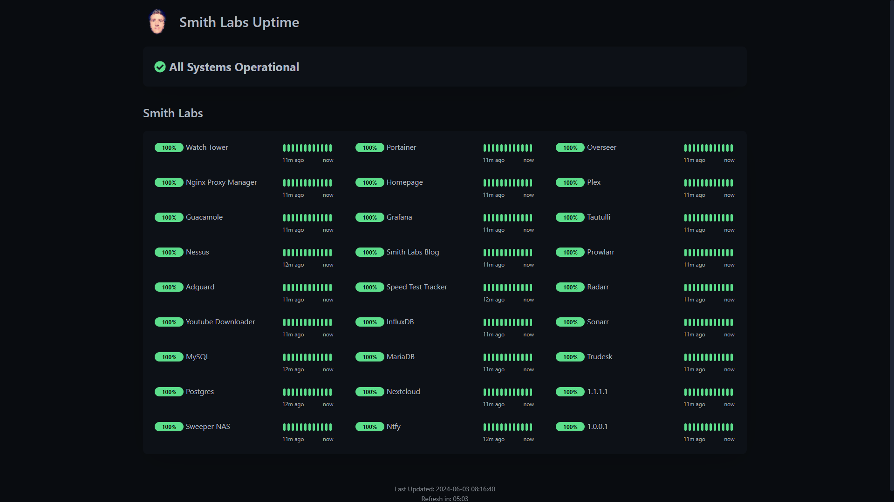

# Uptime Kuma ([Website]{:target="_blank"})

[Website]: https://github.com/louislam/uptime-kuma


## About Uptime Kuma

Uptime Kuma is a self-hosted monitoring tool that helps you track the availability and performance of your websites and services. It provides real-time monitoring and alerts for downtime or performance issues, allowing you to set up custom checks for various endpoints, including HTTP(s), TCP, and ping. Uptime Kuma features a user-friendly interface with detailed dashboards, historical data, and notification integrations, making it easy to keep an eye on your services' uptime and reliability.

## Screenshots



## Docker Compose (`docker-compose.yaml`)
``` yaml
services:
  uptime-kuma:
    image: louislam/uptime-kuma:1
    container_name: uptime-kuma
    restart: unless-stopped
    ports:
      - ${KUMA_PORT}:3001
    volumes:
      - /etc/timezone:/etc/timezone
      - ${KUMA_DIR}:/app/data
      - ${DOCKER_SOCK}
    environment:
      - UPTIME_KUMA_DISABLE_FRAME_SAMEORIGIN=true
```

## Environment File (`.env`)
```
KUMA_PORT=3001
KUMA_DIR=path/to/kuma/dir
DOCKER_SOCK=/var/run/docker.sock:/var/run/docker.sock
```